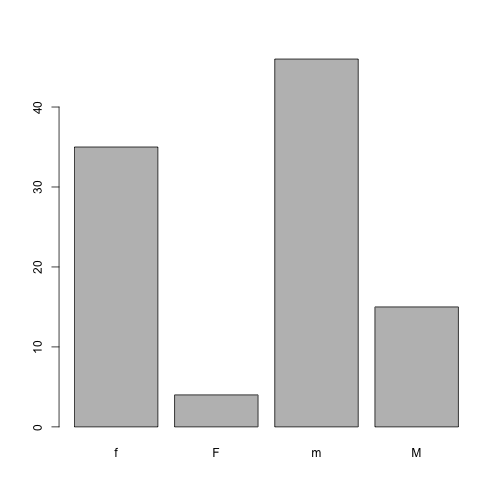
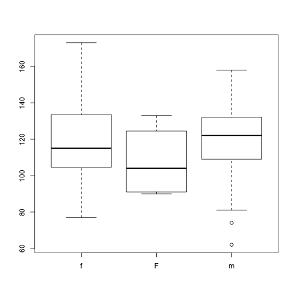
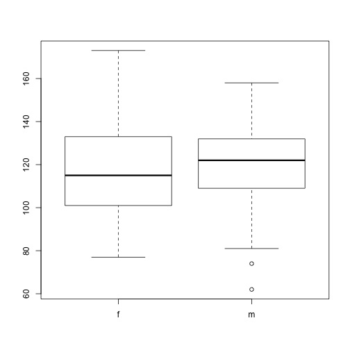

One of R's most powerful features is its ability to deal with tabular data -
like what you might already have in a spreadsheet or a CSV. Let's start by
making a toy dataset in your `data/` directory, called `feline-data.csv`:


~~~
coat,weight,likes_string
calico,2.1,1
black,5.0,0
tabby,3.2,1
~~~
{: .r}

> ## Tip: Editing Text files in R
>
> Alternatively, you can create `data/feline-data.csv` using a text editor (Nano),
> or within RStudio with the **File -> New File -> Text File** menu item.
{: .callout}


We can load this into R via the following:


~~~
cats <- read.csv(file = "data/feline-data.csv")
cats
~~~
{: .r}


~~~
    coat weight likes_string
1 calico    2.1            1
2  black    5.0            0
3  tabby    3.2            1
~~~
{: .output}


The `read.csv` function is used for reading in tabular data stored in a text
file where the columns of data are delimited by commas (csv = comma-separated
values). Tabs are also commonly used to separated columns - if your data are in
this format you can use the function `read.delim`. If the columns in your data
are delimited by a character other than commas or tabs, you can use the more
general and flexible `read.table` function.


We can begin exploring our dataset right away, pulling out columns by specifying
them using the `$` operator:


~~~
cats$weight
~~~
{: .r}


~~~
[1] 2.1 5.0 3.2
~~~
{: .output}


~~~
cats$coat
~~~
{: .r}


~~~
[1] calico black  tabby 
Levels: black calico tabby
~~~
{: .output}

We can do other operations on the columns:


~~~
## Say we discovered that the scale weighs two Kg light:
cats$weight + 2
~~~
{: .r}


~~~
[1] 4.1 7.0 5.2
~~~
{: .output}


~~~
paste("My cat is", cats$coat)
~~~
{: .r}


~~~
[1] "My cat is calico" "My cat is black"  "My cat is tabby" 
~~~
{: .output}

But what about


~~~
cats$weight + cats$coat
~~~
{: .r}


~~~
Warning in Ops.factor(cats$weight, cats$coat): '+' not meaningful for
factors
~~~
{: .error}


~~~
[1] NA NA NA
~~~
{: .output}

Understanding what happened here is key to successfully analyzing data in R.


### Understanding Basic Data Types in R

To make the best of the R language, you'll need a strong understanding of the
basic data types and data structures and how to operate on those.

Very important to understand because these are the objects you will manipulate
on a day-to-day basis in R. Dealing with object conversions is one of the most
common sources of frustration for beginners.

**Everything** in R is an object.

R has 6 (although we will not discuss the raw class for this workshop) atomic
vector types.

* character
* numeric (real or decimal)
* integer
* logical
* complex

By *atomic*, we mean the vector only holds data of a single type.

* **character**: `"a"`, `"swc"`
* **numeric**: `2`, `15.5`
* **integer**: `2L` (the `L` tells R to store this as an integer)
* **logical**: `TRUE`, `FALSE`
* **complex**: `1+4i` (complex numbers with real and imaginary parts)

R provides many functions to examine features of vectors and other objects, for
example

* `class()` - what kind of object is it (high-level)?
* `typeof()` - what is the object's data type (low-level)?
* `length()` - how long is it? What about two dimensional objects?
* `attributes()` - does it have any metadata?


~~~
# Example
x <- "dataset"
typeof(x)
~~~
{: .r}


~~~
[1] "character"
~~~
{: .output}


~~~
attributes(x)
~~~
{: .r}


~~~
NULL
~~~
{: .output}


~~~
y <- 1:10
y
~~~
{: .r}


~~~
 [1]  1  2  3  4  5  6  7  8  9 10
~~~
{: .output}


~~~
typeof(y)
~~~
{: .r}


~~~
[1] "integer"
~~~
{: .output}


~~~
length(y)
~~~
{: .r}


~~~
[1] 10
~~~
{: .output}


~~~
z <- as.numeric(y)
z
~~~
{: .r}


~~~
 [1]  1  2  3  4  5  6  7  8  9 10
~~~
{: .output}


~~~
typeof(z)
~~~
{: .r}


~~~
[1] "double"
~~~
{: .output}

R has many __data structures__. These include

* atomic vector
* list
* matrix
* data frame
* factors

### Atomic Vectors

A vector is the most common and basic data structure in R and is pretty much the
workhorse of R. Technically, vectors can be one of two types:

* atomic vectors
* lists

although the term "vector" most commonly refers to the atomic types not to lists.

### The Different Vector Modes

A vector is a collection of elements that are most commonly of mode `character`,
`logical`, `integer` or `numeric`.

You can create an empty vector with `vector()`. (By default the mode is
`logical`. You can be more explicit as shown in the examples below.) It is more
common to use direct constructors such as `character()`, `numeric()`, etc.


~~~
vector() # an empty 'logical' (the default) vector
~~~
{: .r}


~~~
logical(0)
~~~
{: .output}


~~~
vector("character", length = 5) # a vector of mode 'character' with 5 elements
~~~
{: .r}


~~~
[1] "" "" "" "" ""
~~~
{: .output}


~~~
character(5) # the same thing, but using the constructor directly
~~~
{: .r}


~~~
[1] "" "" "" "" ""
~~~
{: .output}


~~~
numeric(5)   # a numeric vector with 5 elements
~~~
{: .r}


~~~
[1] 0 0 0 0 0
~~~
{: .output}


~~~
logical(5)   # a logical vector with 5 elements
~~~
{: .r}


~~~
[1] FALSE FALSE FALSE FALSE FALSE
~~~
{: .output}

You can also create vectors by directly specifying their content. R will then
guess the appropriate mode of storage for the vector. For instance:


~~~
x <- c(1, 2, 3)
~~~
{: .r}

will create a vector `x` of mode `numeric`. These are the most common kind, and
are treated as double precision real numbers. If you wanted to explicitly create
integers, you need to add an `L` to each element (or *coerce* to the integer
type using `as.integer()`).


~~~
x1 <- c(1L, 2L, 3L)
~~~
{: .r}

Using `TRUE` and `FALSE` will create a vector of mode `logical`:


~~~
y <- c(TRUE, TRUE, FALSE, FALSE)
~~~
{: .r}

While using quoted text will create a vector of mode `character`:


~~~
z <- c("Sarah", "Tracy", "Jon")
~~~
{: .r}

### Examining Vectors

The functions `typeof()`, `length()`, `class()` and `str()` provide useful
information about your vectors and R objects in general.


~~~
typeof(z)
~~~
{: .r}


~~~
[1] "character"
~~~
{: .output}


~~~
length(z)
~~~
{: .r}


~~~
[1] 3
~~~
{: .output}


~~~
class(z)
~~~
{: .r}


~~~
[1] "character"
~~~
{: .output}


~~~
str(z)
~~~
{: .r}


~~~
 chr [1:3] "Sarah" "Tracy" "Jon"
~~~
{: .output}

> ## Finding Commonalities
>
> Do you see a property that's common to all these vectors above?
{: .challenge}

### Adding Elements

The function `c()` (for combine) can also be used to add elements to a vector.


~~~
z <- c(z, "Annette")
z
~~~
{: .r}


~~~
[1] "Sarah"   "Tracy"   "Jon"     "Annette"
~~~
{: .output}


~~~
z <- c("Greg", z)
z
~~~
{: .r}


~~~
[1] "Greg"    "Sarah"   "Tracy"   "Jon"     "Annette"
~~~
{: .output}

### Vectors from a Sequence of Numbers

You can create vectors as a sequence of numbers.


~~~
series <- 1:10
seq(10)
~~~
{: .r}


~~~
 [1]  1  2  3  4  5  6  7  8  9 10
~~~
{: .output}


~~~
seq(from = 1, to = 10, by = 0.1)
~~~
{: .r}


~~~
 [1]  1.0  1.1  1.2  1.3  1.4  1.5  1.6  1.7  1.8  1.9  2.0  2.1  2.2  2.3
[15]  2.4  2.5  2.6  2.7  2.8  2.9  3.0  3.1  3.2  3.3  3.4  3.5  3.6  3.7
[29]  3.8  3.9  4.0  4.1  4.2  4.3  4.4  4.5  4.6  4.7  4.8  4.9  5.0  5.1
[43]  5.2  5.3  5.4  5.5  5.6  5.7  5.8  5.9  6.0  6.1  6.2  6.3  6.4  6.5
[57]  6.6  6.7  6.8  6.9  7.0  7.1  7.2  7.3  7.4  7.5  7.6  7.7  7.8  7.9
[71]  8.0  8.1  8.2  8.3  8.4  8.5  8.6  8.7  8.8  8.9  9.0  9.1  9.2  9.3
[85]  9.4  9.5  9.6  9.7  9.8  9.9 10.0
~~~
{: .output}

### Missing Data

R supports missing data in vectors. They are represented as `NA` (Not Available)
and can be used for all the vector types covered in this lesson:


~~~
x <- c(0.5, NA, 0.7)
x <- c(TRUE, FALSE, NA)
x <- c("a", NA, "c", "d", "e")
x <- c(1+5i, 2-3i, NA)
~~~
{: .r}

The function `is.na()` indicates the elements of the vectors that represent
missing data, and the function `anyNA()` returns `TRUE` if the vector contains
any missing values:


~~~
x <- c("a", NA, "c", "d", NA)
y <- c("a", "b", "c", "d", "e")
is.na(x)
~~~
{: .r}


~~~
[1] FALSE  TRUE FALSE FALSE  TRUE
~~~
{: .output}


~~~
is.na(y)
~~~
{: .r}


~~~
[1] FALSE FALSE FALSE FALSE FALSE
~~~
{: .output}


~~~
anyNA(x)
~~~
{: .r}


~~~
[1] TRUE
~~~
{: .output}


~~~
anyNA(y)
~~~
{: .r}


~~~
[1] FALSE
~~~
{: .output}

### Other Special Values

`Inf` is infinity. You can have either positive or negative infinity.


~~~
1/0
~~~
{: .r}


~~~
[1] Inf
~~~
{: .output}

`NaN` means Not a Number. It's an undefined value.


~~~
0/0
~~~
{: .r}


~~~
[1] NaN
~~~
{: .output}

### What Happens When You Mix Types Inside a Vector?

R will create a resulting vector with a mode that can most easily accommodate
all the elements it contains. This conversion between modes of storage is called
"coercion". When R converts the mode of storage based on its content, it is
referred to as "implicit coercion". For instance, can you guess what the
following do (without running them first)?


~~~
xx <- c(1.7, "a")
xx <- c(TRUE, 2)
xx <- c("a", TRUE)
~~~
{: .r}

You can also control how vectors are coerced explicitly using the
`as.<class_name>()` functions:


~~~
as.numeric("1")
~~~
{: .r}


~~~
[1] 1
~~~
{: .output}


~~~
as.character(1:2)
~~~
{: .r}


~~~
[1] "1" "2"
~~~
{: .output}

### Objects Attributes

Objects can have __attributes__. Attributes are part of the object. These include:

* names
* dimnames
* dim
* class
* attributes (contain metadata)

You can also glean other attribute-like information such as length (works on
vectors and lists) or number of characters (for character strings).


~~~
length(1:10)
~~~
{: .r}


~~~
[1] 10
~~~
{: .output}


~~~
nchar("Software Carpentry")
~~~
{: .r}


~~~
[1] 18
~~~
{: .output}


## Data Types

If you guessed that the last command will return an error because `2.1` plus
`"black"` is nonsense, you're right - and you already have some intuition for an
important concept in programming called *data types*. We can ask what type of
data something is:


~~~
typeof(cats$weight)
~~~
{: .r}


~~~
[1] "double"
~~~
{: .output}

There are 5 main types: `double`, `integer`, `complex`, `logical` and `character`.


~~~
typeof(3.14)
~~~
{: .r}


~~~
[1] "double"
~~~
{: .output}


~~~
typeof(1L) # The L suffix forces the number to be an integer, since by default R uses float numbers
~~~
{: .r}


~~~
[1] "integer"
~~~
{: .output}


~~~
typeof(1+1i)
~~~
{: .r}


~~~
[1] "complex"
~~~
{: .output}


~~~
typeof(TRUE)
~~~
{: .r}


~~~
[1] "logical"
~~~
{: .output}


~~~
typeof('banana')
~~~
{: .r}


~~~
[1] "character"
~~~
{: .output}

No matter how
complicated our analyses become, all data in R is interpreted as one of these
basic data types. This strictness has some really important consequences.

A user has added details of another cat. This information is in the file
`data/feline-data_v2.csv`.


~~~
file.show("data/feline-data_v2.csv")
~~~
{: .r}


~~~
coat,weight,likes_string
calico,2.1,1
black,5.0,0
tabby,3.2,1
tabby,2.3 or 2.4,1
~~~
{: .r}

Load the new cats data like before, and check what type of data we find in the
`weight` column:


~~~
cats <- read.csv(file="data/feline-data_v2.csv")
typeof(cats$weight)
~~~
{: .r}


~~~
[1] "integer"
~~~
{: .output}


Oh no, our weights aren't the double type anymore! If we try to do the same math
we did on them before, we run into trouble:


~~~
cats$weight + 2
~~~
{: .r}


~~~
Warning in Ops.factor(cats$weight, 2): '+' not meaningful for factors
~~~
{: .error}


~~~
[1] NA NA NA NA
~~~
{: .output}

What happened? When R reads a csv into one of these tables, it insists that
everything in a column be the same basic type; if it can't understand
*everything* in the column as a double, then *nobody* in the column gets to be a
double. The table that R loaded our cats data into is something called a
*data.frame*, and it is our first example of something called a *data
structure* - that is, a structure which R knows how to build out of the basic
data types.

We can see that it is a *data.frame* by calling the `class` function on it:


~~~
class(cats)
~~~
{: .r}


~~~
[1] "data.frame"
~~~
{: .output}

In order to successfully use our data in R, we need to understand what the basic
data structures are, and how they behave. For now, let's remove that extra line
from our cats data and reload it, while we investigate this behavior further:

feline-data.csv:

```
coat,weight,likes_string
calico,2.1,1
black,5.0,0
tabby,3.2,1
```

And back in RStudio:


~~~
cats <- read.csv(file="data/feline-data.csv")
~~~
{: .r}


## Vectors and Type Coercion

To better understand this behavior, let's meet another of the data structures:
the *vector*.


~~~
my_vector <- vector(length = 3)
my_vector
~~~
{: .r}


~~~
[1] FALSE FALSE FALSE
~~~
{: .output}

A vector in R is essentially an ordered list of things, with the special
condition that *everything in the vector must be the same basic data type*. If
you don't choose the datatype, it'll default to `logical`; or, you can declare
an empty vector of whatever type you like.


~~~
another_vector <- vector(mode='character', length=3)
another_vector
~~~
{: .r}


~~~
[1] "" "" ""
~~~
{: .output}

You can check if something is a vector:


~~~
str(another_vector)
~~~
{: .r}


~~~
 chr [1:3] "" "" ""
~~~
{: .output}

The somewhat cryptic output from this command indicates the basic data type
found in this vector - in this case `chr`, character; an indication of the
number of things in the vector - actually, the indexes of the vector, in this
case `[1:3]`; and a few examples of what's actually in the vector - in this case
empty character strings. If we similarly do


~~~
str(cats$weight)
~~~
{: .r}


~~~
 num [1:3] 2.1 5 3.2
~~~
{: .output}

we see that that's a vector, too - *the columns of data we load into R
data.frames are all vectors*, and that's the root of why R forces everything in
a column to be the same basic data type.

> ## Discussion 1
>
> Why is R so opinionated about what we put in our columns of data?
> How does this help us?
>
> > ## Discussion 1
> >
> > By keeping everything in a column the same, we allow ourselves to make simple
> > assumptions about our data; if you can interpret one entry in the column as a
> > number, then you can interpret *all* of them as numbers, so we don't have to
> > check every time. This consistency, like consistently using the same separator
> > in our data files, is what people mean when they talk about *clean data*; in
> > the long run, strict consistency goes a long way to making our lives easier in
> > R.
> {: .solution}
{: .discussion}

You can also make vectors with explicit contents with the combine function:


~~~
combine_vector <- c(2,6,3)
combine_vector
~~~
{: .r}


~~~
[1] 2 6 3
~~~
{: .output}

Given what we've learned so far, what do you think the following will produce?


~~~
quiz_vector <- c(2,6,'3')
~~~
{: .r}

This is something called *type coercion*, and it is the source of many surprises
and the reason why we need to be aware of the basic data types and how R will
interpret them. When R encounters a mix of types (here numeric and character) to
be combined into a single vector, it will force them all to be the same
type. Consider:


~~~
coercion_vector <- c('a', TRUE)
coercion_vector
~~~
{: .r}


~~~
[1] "a"    "TRUE"
~~~
{: .output}


~~~
another_coercion_vector <- c(0, TRUE)
another_coercion_vector
~~~
{: .r}


~~~
[1] 0 1
~~~
{: .output}

The coercion rules go: `logical` -> `integer` -> `numeric` -> `complex` ->
`character`, where -> can be read as *are transformed into*. You can try to
force coercion against this flow using the `as.` functions:


~~~
character_vector_example <- c('0','2','4')
character_vector_example
~~~
{: .r}


~~~
[1] "0" "2" "4"
~~~
{: .output}


~~~
character_coerced_to_numeric <- as.numeric(character_vector_example)
character_coerced_to_numeric
~~~
{: .r}


~~~
[1] 0 2 4
~~~
{: .output}


~~~
numeric_coerced_to_logical <- as.logical(character_coerced_to_numeric)
numeric_coerced_to_logical
~~~
{: .r}


~~~
[1] FALSE  TRUE  TRUE
~~~
{: .output}

As you can see, some surprising things can happen when R forces one basic data
type into another! Nitty-gritty of type coercion aside, the point is: if your
data doesn't look like what you thought it was going to look like, type coercion
may well be to blame; make sure everything is the same type in your vectors and
your columns of data.frames, or you will get nasty surprises!

But coercion can also be very useful! For example, in our `cats` data
`likes_string` is numeric, but we know that the 1s and 0s actually represent
`TRUE` and `FALSE` (a common way of representing them). We should use the
`logical` datatype here, which has two states: `TRUE` or `FALSE`, which is
exactly what our data represents. We can 'coerce' this column to be `logical` by
using the `as.logical` function:


~~~
cats$likes_string
~~~
{: .r}


~~~
[1] 1 0 1
~~~
{: .output}


~~~
cats$likes_string <- as.logical(cats$likes_string)
cats$likes_string
~~~
{: .r}


~~~
[1]  TRUE FALSE  TRUE
~~~
{: .output}

Combine `c()` will also append things to an existing vector:


~~~
ab_vector <- c('a', 'b')
ab_vector
~~~
{: .r}


~~~
[1] "a" "b"
~~~
{: .output}


~~~
combine_example <- c(ab_vector, 'SWC')
combine_example
~~~
{: .r}


~~~
[1] "a"   "b"   "SWC"
~~~
{: .output}

You can also make series of numbers:


~~~
mySeries <- 1:10
mySeries
~~~
{: .r}


~~~
 [1]  1  2  3  4  5  6  7  8  9 10
~~~
{: .output}


~~~
seq(10)
~~~
{: .r}


~~~
 [1]  1  2  3  4  5  6  7  8  9 10
~~~
{: .output}


~~~
seq(1,10, by=0.1)
~~~
{: .r}


~~~
 [1]  1.0  1.1  1.2  1.3  1.4  1.5  1.6  1.7  1.8  1.9  2.0  2.1  2.2  2.3
[15]  2.4  2.5  2.6  2.7  2.8  2.9  3.0  3.1  3.2  3.3  3.4  3.5  3.6  3.7
[29]  3.8  3.9  4.0  4.1  4.2  4.3  4.4  4.5  4.6  4.7  4.8  4.9  5.0  5.1
[43]  5.2  5.3  5.4  5.5  5.6  5.7  5.8  5.9  6.0  6.1  6.2  6.3  6.4  6.5
[57]  6.6  6.7  6.8  6.9  7.0  7.1  7.2  7.3  7.4  7.5  7.6  7.7  7.8  7.9
[71]  8.0  8.1  8.2  8.3  8.4  8.5  8.6  8.7  8.8  8.9  9.0  9.1  9.2  9.3
[85]  9.4  9.5  9.6  9.7  9.8  9.9 10.0
~~~
{: .output}

We can ask a few questions about vectors:


~~~
sequence_example <- seq(10)
head(sequence_example, n=2)
~~~
{: .r}


~~~
[1] 1 2
~~~
{: .output}


~~~
tail(sequence_example, n=4)
~~~
{: .r}


~~~
[1]  7  8  9 10
~~~
{: .output}


~~~
length(sequence_example)
~~~
{: .r}


~~~
[1] 10
~~~
{: .output}


~~~
class(sequence_example)
~~~
{: .r}


~~~
[1] "integer"
~~~
{: .output}


~~~
typeof(sequence_example)
~~~
{: .r}


~~~
[1] "integer"
~~~
{: .output}

Finally, you can give names to elements in your vector:


~~~
my_example <- 5:8
names(my_example) <- c("a", "b", "c", "d")
my_example
~~~
{: .r}


~~~
a b c d 
5 6 7 8 
~~~
{: .output}


~~~
names(my_example)
~~~
{: .r}


~~~
[1] "a" "b" "c" "d"
~~~
{: .output}

> ## Challenge 1
>
> Start by making a vector with the numbers 1 through 26.
> Multiply the vector by 2, and give the resulting vector
> names A through Z (hint: there is a built in vector called `LETTERS`)
>
> > ## Solution to Challenge 1
> >
> > 
> > ~~~
> > x <- 1:26
> > x <- x * 2
> > names(x) <- LETTERS
> > ~~~
> > {: .r}
> {: .solution}
{: .challenge}


## Data Frames

We said that columns in data.frames were vectors:


~~~
str(cats$weight)
~~~
{: .r}


~~~
 num [1:3] 2.1 5 3.2
~~~
{: .output}


~~~
str(cats$likes_string)
~~~
{: .r}


~~~
 logi [1:3] TRUE FALSE TRUE
~~~
{: .output}

These make sense. But what about


~~~
str(cats$coat)
~~~
{: .r}


~~~
 Factor w/ 3 levels "black","calico",..: 2 1 3
~~~
{: .output}

## Factors


Factors are used to represent categorical data. Factors can be ordered or
unordered and are an important class for statistical analysis and for plotting.

Factors are stored as integers, and have labels associated with these unique
integers. While factors look (and often behave) like character vectors, they are
actually integers under the hood, and you need to be careful when treating them
like strings.

Once created, factors can only contain a pre-defined set values, known as
*levels*. By default, R always sorts *levels* in alphabetical order. For
instance, if you have a factor with 2 levels:

> ## The `factor()` Command
>
> The `factor()` command is used to create and modify factors in R:
>
> 
> ~~~
> sex <- factor(c("male", "female", "female", "male"))
> ~~~
> {: .r}
{: .callout}

R will assign `1` to the level `"female"` and `2` to the level `"male"` (because
`f` comes before `m`, even though the first element in this vector is
`"male"`). You can check this by using the function `levels()`, and check the
number of levels using `nlevels()`:


~~~
levels(sex)
~~~
{: .r}


~~~
[1] "female" "male"  
~~~
{: .output}


~~~
nlevels(sex)
~~~
{: .r}


~~~
[1] 2
~~~
{: .output}

Sometimes, the order of the factors does not matter, other times you might want
to specify the order because it is meaningful (e.g., "low", "medium", "high") or
it is required by particular type of analysis. Additionally, specifying the
order of the levels allows us to compare levels:


~~~
food <- factor(c("low", "high", "medium", "high", "low", "medium", "high"))
levels(food)
~~~
{: .r}


~~~
[1] "high"   "low"    "medium"
~~~
{: .output}


~~~
food <- factor(food, levels = c("low", "medium", "high"))
levels(food)
~~~
{: .r}


~~~
[1] "low"    "medium" "high"  
~~~
{: .output}


~~~
min(food) ## doesn't work
~~~
{: .r}


~~~
Error in Summary.factor(structure(c(1L, 3L, 2L, 3L, 1L, 2L, 3L), .Label = c("low", : 'min' not meaningful for factors
~~~
{: .error}


~~~
food <- factor(food, levels = c("low", "medium", "high"), ordered=TRUE)
levels(food)
~~~
{: .r}


~~~
[1] "low"    "medium" "high"  
~~~
{: .output}


~~~
min(food) ## works!
~~~
{: .r}


~~~
[1] low
Levels: low < medium < high
~~~
{: .output}

In R's memory, these factors are represented by numbers (1, 2, 3). They are
better than using simple integer labels because factors are self describing:
`"low"`, `"medium"`, and `"high"`" is more descriptive than `1`, `2`, `3`. Which
is low?  You wouldn't be able to tell with just integer data. Factors have this
information built in. It is particularly helpful when there are many levels
(like the subjects in our example data set).

> ## Representing Data in R
>
> You have a vector representing levels of exercise undertaken by 5 subjects
>
> **"l","n","n","i","l"** ; n=none, l=light, i=intense
>
> What is the best way to represent this in R?
>
> a) exercise <- c("l", "n", "n", "i", "l")
>
> b) exercise <- factor(c("l", "n", "n", "i", "l"), ordered = TRUE)
>
> c) exercise < -factor(c("l", "n", "n", "i", "l"), levels = c("n", "l", "i"), ordered = FALSE)
>
> d) exercise <- factor(c("l", "n", "n", "i", "l"), levels = c("n", "l", "i"), ordered = TRUE)
{: .challenge}

###  Converting Factors

Converting from a factor to a number can cause problems:


~~~
f <- factor(c(3.4, 1.2, 5))
as.numeric(f)
~~~
{: .r}


~~~
[1] 2 1 3
~~~
{: .output}

This does not behave as expected (and there is no warning).

The recommended way is to use the integer vector to index the factor levels:


~~~
levels(f)[f]
~~~
{: .r}


~~~
[1] "3.4" "1.2" "5"  
~~~
{: .output}

This returns a character vector, the `as.numeric()` function is still required to convert the values to the proper type (numeric).


~~~
f <- levels(f)[f]
f <- as.numeric(f)
~~~
{: .r}

### Using Factors

Lets load our example data to see the use of factors:


~~~
dat <- read.csv(file = 'data/sample.csv', stringsAsFactors = TRUE)
~~~
{: .r}

> ## Default Behavior
>
> `stringsAsFactors=TRUE` is the default behavior for R.
> We could leave this argument out.
> It is included here for clarity.
{: .callout}


~~~
str(dat)
~~~
{: .r}


~~~
'data.frame':	100 obs. of  9 variables:
 $ ID           : Factor w/ 100 levels "Sub001","Sub002",..: 1 2 3 4 5 6 7 8 9 10 ...
 $ Gender       : Factor w/ 4 levels "f","F","m","M": 3 3 3 1 3 4 1 3 3 1 ...
 $ Group        : Factor w/ 3 levels "Control","Treatment1",..: 1 3 3 2 2 3 1 3 3 1 ...
 $ BloodPressure: int  132 139 130 105 125 112 173 108 131 129 ...
 $ Age          : num  16 17.2 19.5 15.7 19.9 14.3 17.7 19.8 19.4 18.8 ...
 $ Aneurisms_q1 : int  114 148 196 199 188 260 135 216 117 188 ...
 $ Aneurisms_q2 : int  140 209 251 140 120 266 98 238 215 144 ...
 $ Aneurisms_q3 : int  202 248 122 233 222 320 154 279 181 192 ...
 $ Aneurisms_q4 : int  237 248 177 220 228 294 245 251 272 185 ...
~~~
{: .output}

Notice the first 3 columns have been converted to factors. These values were text in the data file so R automatically interpreted them as categorical variables.


~~~
summary(dat)
~~~
{: .r}


~~~
       ID     Gender        Group    BloodPressure        Age       
 Sub001 : 1   f:35   Control   :30   Min.   : 62.0   Min.   :12.10  
 Sub002 : 1   F: 4   Treatment1:35   1st Qu.:107.5   1st Qu.:14.78  
 Sub003 : 1   m:46   Treatment2:35   Median :117.5   Median :16.65  
 Sub004 : 1   M:15                   Mean   :118.6   Mean   :16.42  
 Sub005 : 1                          3rd Qu.:133.0   3rd Qu.:18.30  
 Sub006 : 1                          Max.   :173.0   Max.   :20.00  
 (Other):94                                                         
  Aneurisms_q1    Aneurisms_q2    Aneurisms_q3    Aneurisms_q4  
 Min.   : 65.0   Min.   : 80.0   Min.   :105.0   Min.   :116.0  
 1st Qu.:118.0   1st Qu.:131.5   1st Qu.:182.5   1st Qu.:186.8  
 Median :158.0   Median :162.5   Median :217.0   Median :219.0  
 Mean   :158.8   Mean   :168.0   Mean   :219.8   Mean   :217.9  
 3rd Qu.:188.0   3rd Qu.:196.8   3rd Qu.:248.2   3rd Qu.:244.2  
 Max.   :260.0   Max.   :283.0   Max.   :323.0   Max.   :315.0  
                                                                
~~~
{: .output}

Notice the `summary()` function handles factors differently to numbers (and strings), the occurrence counts for each value is often more useful information.

> ## The `summary()` Function
>
> The `summary()` function is a great way of spotting errors in your data (look at the *dat$Gender* column).
> It's also a great way for spotting missing data.
{: .callout}

> ## Reordering Factors
>
> The function `table()` tabulates observations and can be used to create bar plots quickly. For instance:
>
> 
> ~~~
> table(dat$Group)
> ~~~
> {: .r}
> 
> 
> 
> ~~~
> 
>    Control Treatment1 Treatment2 
>         30         35         35 
> ~~~
> {: .output}
> 
> 
> 
> ~~~
> barplot(table(dat$Group))
> ~~~
> {: .r}
> 
> 
> Use the `factor()` command to modify the column dat$Group so that the *control* group is plotted last
{: .challenge}

### Removing Levels from a Factor

Some of the Gender values in our dataset have been coded incorrectly.
Let's remove factors.


~~~
barplot(table(dat$Gender))
~~~
{: .r}



Values should have been recorded as lowercase 'm' & 'f'. We should correct this.


~~~
dat$Gender[dat$Gender == 'M'] <- 'm'
~~~
{: .r}

> ## Updating Factors
>
> 
> ~~~
> plot(x = dat$Gender, y = dat$BloodPressure)
> ~~~
> {: .r}
> 
> 
>
> Why does this plot show 4 levels?
>
> *Hint* how many levels does dat$Gender have?
{: .challenge}

We need to tell R that "M" is no longer a valid value for this column.
We use the `droplevels()` function to remove extra levels.


~~~
dat$Gender <- droplevels(dat$Gender)
plot(x = dat$Gender, y = dat$BloodPressure)
~~~
{: .r}



> ## Adjusting Factor Levels
>
> Adjusting the `levels()` of a factor provides a useful shortcut for reassigning values in this case.
>
> 
> ~~~
> levels(dat$Gender)[2] <- 'f'
> plot(x = dat$Gender, y = dat$BloodPressure)
> ~~~
> {: .r}
> 
> 
{: .callout}


Another important data structure is called a *factor*. Factors usually look like
character data, but are typically used to represent categorical information. For
example, let's make a vector of strings labelling cat colorations for all the
cats in our study:


~~~
coats <- c('tabby', 'tortoiseshell', 'tortoiseshell', 'black', 'tabby')
coats
~~~
{: .r}


~~~
[1] "tabby"         "tortoiseshell" "tortoiseshell" "black"        
[5] "tabby"        
~~~
{: .output}


~~~
str(coats)
~~~
{: .r}


~~~
 chr [1:5] "tabby" "tortoiseshell" "tortoiseshell" "black" ...
~~~
{: .output}

We can turn a vector into a factor like so:


~~~
CATegories <- factor(coats)
class(CATegories)
~~~
{: .r}


~~~
[1] "factor"
~~~
{: .output}


~~~
str(CATegories)
~~~
{: .r}


~~~
 Factor w/ 3 levels "black","tabby",..: 2 3 3 1 2
~~~
{: .output}

Now R has noticed that there are three possible categories in our data - but it
also did something surprising; instead of printing out the strings we gave it,
we got a bunch of numbers instead. R has replaced our human-readable categories
with numbered indices under the hood:


~~~
typeof(coats)
~~~
{: .r}


~~~
[1] "character"
~~~
{: .output}


~~~
typeof(CATegories)
~~~
{: .r}


~~~
[1] "integer"
~~~
{: .output}

> ## Challenge 2
>
> Is there a factor in our `cats` data.frame? what is its name?
> Try using `?read.csv` to figure out how to keep text columns as character
> vectors instead of factors; then write a command or two to show that the factor
> in `cats` is actually a character vector when loaded in this way.
>
> > ## Solution to Challenge 2
> >
> > One solution is use the argument `stringAsFactors`:
> >
> > 
> > ~~~
> > cats <- read.csv(file="data/feline-data.csv", stringsAsFactors=FALSE)
> > str(cats$coat)
> > ~~~
> > {: .r}
> >
> > Another solution is use the argument `colClasses`
> > that allow finer control.
> >
> > 
> > ~~~
> > cats <- read.csv(file="data/feline-data.csv", colClasses=c(NA, NA, "character"))
> > str(cats$coat)
> > ~~~
> > {: .r}
> >
> > Note: new students find the help files difficult to understand; make sure to let them know
> > that this is typical, and encourage them to take their best guess based on semantic meaning,
> > even if they aren't sure.
> {: .solution}
{: .challenge}

In modelling functions, it's important to know what the baseline levels are. This
is assumed to be the first factor, but by default factors are labelled in
alphabetical order. You can change this by specifying the levels:


~~~
mydata <- c("case", "control", "control", "case")
factor_ordering_example <- factor(mydata, levels = c("control", "case"))
str(factor_ordering_example)
~~~
{: .r}


~~~
 Factor w/ 2 levels "control","case": 2 1 1 2
~~~
{: .output}

In this case, we've explicitly told R that "control" should represented by 1, and
"case" by 2. This designation can be very important for interpreting the
results of statistical models!

## Lists

Another data structure you'll want in your bag of tricks is the `list`. A list
is simpler in some ways than the other types, because you can put anything you
want in it:


~~~
list_example <- list(1, "a", TRUE, 1+4i)
list_example
~~~
{: .r}


~~~
[[1]]
[1] 1

[[2]]
[1] "a"

[[3]]
[1] TRUE

[[4]]
[1] 1+4i
~~~
{: .output}


~~~
another_list <- list(title = "Research Bazaar", numbers = 1:10, data = TRUE )
another_list
~~~
{: .r}


~~~
$title
[1] "Research Bazaar"

$numbers
 [1]  1  2  3  4  5  6  7  8  9 10

$data
[1] TRUE
~~~
{: .output}

We can now understand something a bit surprising in our data.frame; what happens if we run:


~~~
typeof(cats)
~~~
{: .r}


~~~
[1] "list"
~~~
{: .output}

We see that data.frames look like lists 'under the hood' - this is because a
data.frame is really a list of vectors and factors, as they have to be - in
order to hold those columns that are a mix of vectors and factors, the
data.frame needs something a bit more flexible than a vector to put all the
columns together into a familiar table.  In other words, a `data.frame` is a
special list in which all the vectors must have the same length.

In our `cats` example, we have an integer, a double and a logical variable. As
we have seen already, each column of data.frame is a vector.


~~~
cats$coat
~~~
{: .r}


~~~
[1] calico black  tabby 
Levels: black calico tabby
~~~
{: .output}


~~~
cats[,1]
~~~
{: .r}


~~~
[1] calico black  tabby 
Levels: black calico tabby
~~~
{: .output}


~~~
typeof(cats[,1])
~~~
{: .r}


~~~
[1] "integer"
~~~
{: .output}


~~~
str(cats[,1])
~~~
{: .r}


~~~
 Factor w/ 3 levels "black","calico",..: 2 1 3
~~~
{: .output}

Each row is an *observation* of different variables, itself a data.frame, and
thus can be composed of elements of different types.


~~~
cats[1,]
~~~
{: .r}


~~~
    coat weight likes_string
1 calico    2.1         TRUE
~~~
{: .output}


~~~
typeof(cats[1,])
~~~
{: .r}


~~~
[1] "list"
~~~
{: .output}


~~~
str(cats[1,])
~~~
{: .r}


~~~
'data.frame':	1 obs. of  3 variables:
 $ coat        : Factor w/ 3 levels "black","calico",..: 2
 $ weight      : num 2.1
 $ likes_string: logi TRUE
~~~
{: .output}

> ## Challenge 3
>
> There are several subtly different ways to call variables, observations and
> elements from data.frames:
>
> - `cats[1]`
> - `cats[[1]]`
> - `cats$coat`
> - `cats["coat"]`
> - `cats[1, 1]`
> - `cats[, 1]`
> - `cats[1, ]`
>
> Try out these examples and explain what is returned by each one.
>
> *Hint:* Use the function `typeof()` to examine what is returned in each case.
>
> > ## Solution to Challenge 3
> > 
> > ~~~
> > cats[1]
> > ~~~
> > {: .r}
> > 
> > 
> > 
> > ~~~
> >     coat
> > 1 calico
> > 2  black
> > 3  tabby
> > ~~~
> > {: .output}
> > We can think of a data frame as a list of vectors. The single brace `[1]`
> returns the first slice of the list, as another list. In this case it is the
> first column of the data frame.
> > 
> > ~~~
> > cats[[1]]
> > ~~~
> > {: .r}
> > 
> > 
> > 
> > ~~~
> > [1] calico black  tabby 
> > Levels: black calico tabby
> > ~~~
> > {: .output}
> > The double brace `[[1]]` returns the contents of the list item. In this case
> it is the contents of the first column, a _vector_ of type _factor_.
> > 
> > ~~~
> > cats$coat
> > ~~~
> > {: .r}
> > 
> > 
> > 
> > ~~~
> > [1] calico black  tabby 
> > Levels: black calico tabby
> > ~~~
> > {: .output}
> > This example uses the `$` character to address items by name. _coat_ is the
> first column of the data frame, again a _vector_ of type _factor_.
> > 
> > ~~~
> > cats["coat"]
> > ~~~
> > {: .r}
> > 
> > 
> > 
> > ~~~
> >     coat
> > 1 calico
> > 2  black
> > 3  tabby
> > ~~~
> > {: .output}
> > Here we are using a single brace `["coat"]` replacing the index number with
> the column name. Like example 1, the returned object is a _list_.
> > 
> > ~~~
> > cats[1, 1]
> > ~~~
> > {: .r}
> > 
> > 
> > 
> > ~~~
> > [1] calico
> > Levels: black calico tabby
> > ~~~
> > {: .output}
> > This example uses a single brace, but this time we provide row and column
> coordinates. The returned object is the value in row 1, column 1. The object
> is an _integer_ but because it is part of a _vector_ of type _factor_, R
> displays the label "calico" associated with the integer value.
> > 
> > ~~~
> > cats[, 1]
> > ~~~
> > {: .r}
> > 
> > 
> > 
> > ~~~
> > [1] calico black  tabby 
> > Levels: black calico tabby
> > ~~~
> > {: .output}
> > Like the previous example we use single braces and provide row and column
> coordinates. The row coordinate is not specified, R interprets this missing
> value as all the elements in this _column_ _vector_.
> > 
> > ~~~
> > cats[1, ]
> > ~~~
> > {: .r}
> > 
> > 
> > 
> > ~~~
> >     coat weight likes_string
> > 1 calico    2.1         TRUE
> > ~~~
> > {: .output}
> > Again we use the single brace with row and column coordinates. The column
> coordinate is not specified. The return value is a _list_ containing all the
> values in the first row.
> {: .solution}
{: .challenge}

## Matrices


### Matrix

In R matrices are an extension of the numeric or character vectors. They are not
a separate type of object but simply an atomic vector with dimensions; the
number of rows and columns.


~~~
m <- matrix(nrow = 2, ncol = 2)
m
~~~
{: .r}


~~~
     [,1] [,2]
[1,]   NA   NA
[2,]   NA   NA
~~~
{: .output}


~~~
dim(m)
~~~
{: .r}


~~~
[1] 2 2
~~~
{: .output}

Matrices in R are filled column-wise.


~~~
m <- matrix(1:6, nrow = 2, ncol = 3)
~~~
{: .r}

Other ways to construct a matrix


~~~
m      <- 1:10
dim(m) <- c(2, 5)
~~~
{: .r}

This takes a vector and transforms it into a matrix with 2 rows and 5 columns.

Another way is to bind columns or rows using `cbind()` and `rbind()`.


~~~
x <- 1:3
y <- 10:12
cbind(x, y)
~~~
{: .r}


~~~
     x  y
[1,] 1 10
[2,] 2 11
[3,] 3 12
~~~
{: .output}


~~~
rbind(x, y)
~~~
{: .r}


~~~
  [,1] [,2] [,3]
x    1    2    3
y   10   11   12
~~~
{: .output}

You can also use the `byrow` argument to specify how the matrix is filled. From R's own documentation:


~~~
mdat <- matrix(c(1,2,3, 11,12,13), nrow = 2, ncol = 3, byrow = TRUE)
mdat
~~~
{: .r}


~~~
     [,1] [,2] [,3]
[1,]    1    2    3
[2,]   11   12   13
~~~
{: .output}

Elements of a matrix can be referenced by specifying the index along each dimension (e.g. "row" and "column") in single square brackets.


~~~
mdat[2,3]
~~~
{: .r}


~~~
[1] 13
~~~
{: .output}

### List

In R lists act as containers. Unlike atomic vectors, the contents of a list are
not restricted to a single mode and can encompass any mixture of data
types. Lists are sometimes called generic vectors, because the elements of a
list can by of any type of R object, even lists containing further lists. This
property makes them fundamentally different from atomic vectors.

A list is a special type of vector. Each element can be a different type.

Create lists using `list()` or coerce other objects using `as.list()`. An empty
list of the required length can be created using `vector()`


~~~
x <- list(1, "a", TRUE, 1+4i)
x
~~~
{: .r}


~~~
[[1]]
[1] 1

[[2]]
[1] "a"

[[3]]
[1] TRUE

[[4]]
[1] 1+4i
~~~
{: .output}


~~~
x <- vector("list", length = 5) ## empty list
length(x)
~~~
{: .r}


~~~
[1] 5
~~~
{: .output}

The content of elements of a list can be retrieved by using double square brackets.


~~~
x[[1]]
~~~
{: .r}


~~~
NULL
~~~
{: .output}

Vectors can be coerced to lists as follows:


~~~
x <- 1:10
x <- as.list(x)
length(x)
~~~
{: .r}


~~~
[1] 10
~~~
{: .output}

1. What is the class of `x[1]`?
2. What about `x[[1]]`?


Elements of a list can be named (i.e. lists can have the `names` atttibute)


~~~
xlist <- list(a = "Karthik Ram", b = 1:10, data = head(iris))
xlist
~~~
{: .r}


~~~
$a
[1] "Karthik Ram"

$b
 [1]  1  2  3  4  5  6  7  8  9 10

$data
  Sepal.Length Sepal.Width Petal.Length Petal.Width Species
1          5.1         3.5          1.4         0.2  setosa
2          4.9         3.0          1.4         0.2  setosa
3          4.7         3.2          1.3         0.2  setosa
4          4.6         3.1          1.5         0.2  setosa
5          5.0         3.6          1.4         0.2  setosa
6          5.4         3.9          1.7         0.4  setosa
~~~
{: .output}


~~~
names(xlist)
~~~
{: .r}


~~~
[1] "a"    "b"    "data"
~~~
{: .output}

1. What is the length of this object? What about its structure?

Lists can be extremely useful inside functions. Because the functions in R are able to return only a single object, you can "staple" together lots
of different kinds of results into a single object that a function can return.

A list does not print to the console like a vector. Instead, each element of the
list starts on a new line.

Elements are indexed by double brackets. Single brackets will still return
a(nother) list. If the elements of a list are named, they can be referenced by the `$` notation (i.e. `xlist$data`).


Last but not least is the matrix. We can declare a matrix full of zeros:


~~~
matrix_example <- matrix(0, ncol=6, nrow=3)
matrix_example
~~~
{: .r}


~~~
     [,1] [,2] [,3] [,4] [,5] [,6]
[1,]    0    0    0    0    0    0
[2,]    0    0    0    0    0    0
[3,]    0    0    0    0    0    0
~~~
{: .output}

And similar to other data structures, we can ask things about our matrix:


~~~
class(matrix_example)
~~~
{: .r}


~~~
[1] "matrix"
~~~
{: .output}


~~~
typeof(matrix_example)
~~~
{: .r}


~~~
[1] "double"
~~~
{: .output}


~~~
str(matrix_example)
~~~
{: .r}


~~~
 num [1:3, 1:6] 0 0 0 0 0 0 0 0 0 0 ...
~~~
{: .output}


~~~
dim(matrix_example)
~~~
{: .r}


~~~
[1] 3 6
~~~
{: .output}


~~~
nrow(matrix_example)
~~~
{: .r}


~~~
[1] 3
~~~
{: .output}


~~~
ncol(matrix_example)
~~~
{: .r}


~~~
[1] 6
~~~
{: .output}

> ## Challenge 4
>
> What do you think will be the result of
> `length(matrix_example)`?
> Try it.
> Were you right? Why / why not?
>
> > ## Solution to Challenge 4
> >
> > What do you think will be the result of
> > `length(matrix_example)`?
> >
> > 
> > ~~~
> > matrix_example <- matrix(0, ncol=6, nrow=3)
> > length(matrix_example)
> > ~~~
> > {: .r}
> > 
> > 
> > 
> > ~~~
> > [1] 18
> > ~~~
> > {: .output}
> >
> > Because a matrix is a vector with added dimension attributes, `length`
> > gives you the total number of elements in the matrix.
> {: .solution}
{: .challenge}


> ## Challenge 5
>
> Make another matrix, this time containing the numbers 1:50,
> with 5 columns and 10 rows.
> Did the `matrix` function fill your matrix by column, or by
> row, as its default behaviour?
> See if you can figure out how to change this.
> (hint: read the documentation for `matrix`!)
>
> > ## Solution to Challenge 5
> >
> > Make another matrix, this time containing the numbers 1:50,
> > with 5 columns and 10 rows.
> > Did the `matrix` function fill your matrix by column, or by
> > row, as its default behaviour?
> > See if you can figure out how to change this.
> > (hint: read the documentation for `matrix`!)
> >
> > 
> > ~~~
> > x <- matrix(1:50, ncol=5, nrow=10)
> > x <- matrix(1:50, ncol=5, nrow=10, byrow = TRUE) # to fill by row
> > ~~~
> > {: .r}
> {: .solution}
{: .challenge}


> ## Challenge 6
>  Create a list of length two containing a character vector for each of the sections in this part of the workshop:
>
>  - Data types
>  - Data structures
>
>  Populate each character vector with the names of the data types and data
>  structures we've seen so far.
>
> > ## Solution to Challenge 6
> > 
> > ~~~
> > dataTypes <- c('double', 'complex', 'integer', 'character', 'logical')
> > dataStructures <- c('data.frame', 'vector', 'factor', 'list', 'matrix')
> > answer <- list(dataTypes, dataStructures)
> > ~~~
> > {: .r}
> > Note: it's nice to make a list in big writing on the board or taped to the wall
> > listing all of these types and structures - leave it up for the rest of the workshop
> > to remind people of the importance of these basics.
> >
> {: .solution}
{: .challenge}


> ## Challenge 7
>
> Consider the R output of the matrix below:
> 
> ~~~
>      [,1] [,2]
> [1,]    4    1
> [2,]    9    5
> [3,]   10    7
> ~~~
> {: .output}
> What was the correct command used to write this matrix? Examine
> each command and try to figure out the correct one before typing them.
> Think about what matrices the other commands will produce.
>
> 1. `matrix(c(4, 1, 9, 5, 10, 7), nrow = 3)`
> 2. `matrix(c(4, 9, 10, 1, 5, 7), ncol = 2, byrow = TRUE)`
> 3. `matrix(c(4, 9, 10, 1, 5, 7), nrow = 2)`
> 4. `matrix(c(4, 1, 9, 5, 10, 7), ncol = 2, byrow = TRUE)`
>
> > ## Solution to Challenge 7
> >
> > Consider the R output of the matrix below:
> > 
> > ~~~
> >      [,1] [,2]
> > [1,]    4    1
> > [2,]    9    5
> > [3,]   10    7
> > ~~~
> > {: .output}
> > What was the correct command used to write this matrix? Examine
> > each command and try to figure out the correct one before typing them.
> > Think about what matrices the other commands will produce.
> > 
> > ~~~
> > matrix(c(4, 1, 9, 5, 10, 7), ncol = 2, byrow = TRUE)
> > ~~~
> > {: .r}
> {: .solution}
{: .challenge}


At this point, you've see it all - in the last lesson, we toured all the basic
data types and data structures in R. Everything you do will be a manipulation of
those tools. But a whole lot of the time, the star of the show is going to be
the data frame - the table that we created by loading information from a csv file. In this lesson, we'll learn a few more things
about working with data frames.


## Data Frame

A data frame is a very important data type in R. It's pretty much the *de facto*
data structure for most tabular data and what we use for statistics.

A data frame is a *special type of list* where every element of the list has same length (i.e. data frame is a "rectangular" list).

Data frames can have additional attributes such as `rownames()`, which can be
useful for annotating data, like `subject_id` or `sample_id`. But most of the
time they are not used.

Some additional information on data frames:

* Usually created by `read.csv()` and `read.table()`, i.e. when importing the data into R.
* Assuming all columns in a data frame are of same type, data frame can be converted to a matrix with data.matrix() (preferred) or as.matrix(). Otherwise type coercion will be enforced and the results may not always be what you expect.
* Can also create a new data frame with `data.frame()` function.
* Find the number of rows and columns with `nrow(dat)` and `ncol(dat)`, respectively.
* Rownames are often automatically generated and look like 1, 2, ..., n. Consistency in numbering of rownames may not be honored when rows are reshuffled or subset.

### Creating Data Frames by Hand

To create data frames by hand:


~~~
dat <- data.frame(id = letters[1:10], x = 1:10, y = 11:20)
dat
~~~
{: .r}


~~~
   id  x  y
1   a  1 11
2   b  2 12
3   c  3 13
4   d  4 14
5   e  5 15
6   f  6 16
7   g  7 17
8   h  8 18
9   i  9 19
10  j 10 20
~~~
{: .output}

> ## Useful Data Frame Functions
>
> * `head()` - shows first 6 rows
> * `tail()` - shows last 6 rows
> * `dim()` - returns the dimensions of data frame (i.e. number of rows and number of columns)
> * `nrow()` - number of rows
> * `ncol()` - number of columns
> * `str()` - structure of data frame - name, type and preview of data in each column
> * `names()` - shows the `names` attribute for a data frame, which gives the column names.
> * `sapply(dataframe, class)` - shows the class of each column in the data frame
{: .callout}

See that it is actually a special list:


~~~
is.list(dat)
~~~
{: .r}


~~~
[1] TRUE
~~~
{: .output}


~~~
class(dat)
~~~
{: .r}


~~~
[1] "data.frame"
~~~
{: .output}

Because data frames are rectangular, elements of data frame can be referenced by specifying the row and the column index in single square brackets (similar to matrix).


~~~
dat[1,3]
~~~
{: .r}


~~~
[1] 11
~~~
{: .output}

As data frames are also lists, it is possible to refer to columns (which are elements of such list) using the list notation, i.e. either double square brackets or a `$`.


~~~
dat[["y"]]
~~~
{: .r}


~~~
 [1] 11 12 13 14 15 16 17 18 19 20
~~~
{: .output}


~~~
dat$y
~~~
{: .r}


~~~
 [1] 11 12 13 14 15 16 17 18 19 20
~~~
{: .output}

The following table summarizes the one-dimensional and two-dimensional data structures in R in relation to diversity of data types they can contain.

| Dimensions | Homogenous | Heterogeneous |
| ------- | ---- | ---- |
| 1-D | atomic vector | list |
| 2-D | matrix | data frame |

> Lists can contain elements that are themselves muti-dimensional (e.g. a lists can contain data frames or another type of objects). Lists can also contain elements of any length, therefore list do not necessarily have to be "rectangular". However in order for the list to qualify as a data frame, the lenghth of each element has to be the same. 
{: .callout}


> ## Column Types in Data Frames
>
> Knowing that data frames are lists, can columns be of different type?
>
> What type of structure do you expect to see when you explore the structure of the `iris` data frame? Hint: Use `str()`.
>
> ~~~
> # The Sepal.Length, Sepal.Width, Petal.Length and Petal.Width columns are all
> # numeric types, while Species is a Factor.
> # Lists can have elements of different types.
> # Since a Data Frame is just a special type of list, it can have columns of
> # differing type (although, remember that type must be consistent within each column!).
> str(iris)
> ~~~
> {: .r}
{: .challenge}


## Adding columns and rows in data frame

We learned last time that the columns in a data frame were vectors, so that our
data are consistent in type throughout the column. As such, if we want to add a
new column, we need to start by making a new vector:


~~~
age <- c(2,3,5,12)
cats
~~~
{: .r}


~~~
    coat weight likes_string
1 calico    2.1            1
2  black    5.0            0
3  tabby    3.2            1
~~~
{: .output}

We can then add this as a column via:


~~~
cats <- cbind(cats, age)
~~~
{: .r}


~~~
Error in data.frame(..., check.names = FALSE): arguments imply differing number of rows: 3, 4
~~~
{: .error}

Why didn't this work? Of course, R wants to see one element in our new column
for every row in the table:


~~~
cats
~~~
{: .r}


~~~
    coat weight likes_string
1 calico    2.1            1
2  black    5.0            0
3  tabby    3.2            1
~~~
{: .output}


~~~
age <- c(4,5,8)
cats <- cbind(cats, age)
cats
~~~
{: .r}


~~~
    coat weight likes_string age
1 calico    2.1            1   4
2  black    5.0            0   5
3  tabby    3.2            1   8
~~~
{: .output}

Now how about adding rows - in this case, we saw last time that the rows of a
data frame are made of lists:


~~~
newRow <- list("tortoiseshell", 3.3, TRUE, 9)
cats <- rbind(cats, newRow)
~~~
{: .r}


~~~
Warning in `[<-.factor`(`*tmp*`, ri, value = "tortoiseshell"): invalid
factor level, NA generated
~~~
{: .error}

## Factors

Another thing to look out for has emerged - when R creates a factor, it only
allows whatever is originally there when our data was first loaded, which was
'black', 'calico' and 'tabby' in our case. Anything new that doesn't fit into
one of these categories is rejected as nonsense (becomes NA).

The warning is telling us that we unsuccessfully added 'tortoiseshell' to our
*coat* factor, but 3.3 (a numeric), TRUE (a logical), and 9 (a numeric) were
successfully added to *weight*, *likes_string*, and *age*, respectfully, since
those values are not factors. To successfully add a cat with a
'tortoiseshell' *coat*, explicitly add 'tortoiseshell' as a *level* in the factor:


~~~
levels(cats$coat)
~~~
{: .r}


~~~
[1] "black"  "calico" "tabby" 
~~~
{: .output}


~~~
levels(cats$coat) <- c(levels(cats$coat), 'tortoiseshell')
cats <- rbind(cats, list("tortoiseshell", 3.3, TRUE, 9))
~~~
{: .r}

Alternatively, we can change a factor column to a character vector; we lose the
handy categories of the factor, but can subsequently add any word we want to the
column without babysitting the factor levels:


~~~
str(cats)
~~~
{: .r}


~~~
'data.frame':	5 obs. of  4 variables:
 $ coat        : Factor w/ 4 levels "black","calico",..: 2 1 3 NA 4
 $ weight      : num  2.1 5 3.2 3.3 3.3
 $ likes_string: int  1 0 1 1 1
 $ age         : num  4 5 8 9 9
~~~
{: .output}


~~~
cats$coat <- as.character(cats$coat)
str(cats)
~~~
{: .r}


~~~
'data.frame':	5 obs. of  4 variables:
 $ coat        : chr  "calico" "black" "tabby" NA ...
 $ weight      : num  2.1 5 3.2 3.3 3.3
 $ likes_string: int  1 0 1 1 1
 $ age         : num  4 5 8 9 9
~~~
{: .output}

## Removing rows

We now know how to add rows and columns to our data frame in R - but in our
first attempt to add a 'tortoiseshell' cat to the data frame we've accidentally
added a garbage row:


~~~
cats
~~~
{: .r}


~~~
           coat weight likes_string age
1        calico    2.1            1   4
2         black    5.0            0   5
3         tabby    3.2            1   8
4          <NA>    3.3            1   9
5 tortoiseshell    3.3            1   9
~~~
{: .output}

We can ask for a data frame minus this offending row:


~~~
cats[-4,]
~~~
{: .r}


~~~
           coat weight likes_string age
1        calico    2.1            1   4
2         black    5.0            0   5
3         tabby    3.2            1   8
5 tortoiseshell    3.3            1   9
~~~
{: .output}

Notice the comma with nothing after it to indicate we want to drop the entire fourth row.

Note: We could also remove both new rows at once by putting the row numbers
inside of a vector: `cats[c(-4,-5),]`

Alternatively, we can drop all rows with `NA` values:


~~~
na.omit(cats)
~~~
{: .r}


~~~
           coat weight likes_string age
1        calico    2.1            1   4
2         black    5.0            0   5
3         tabby    3.2            1   8
5 tortoiseshell    3.3            1   9
~~~
{: .output}

Let's reassign the output to `cats`, so that our changes will be permanent:


~~~
cats <- na.omit(cats)
~~~
{: .r}

## Appending to a data frame

The key to remember when adding data to a data frame is that *columns are
vectors or factors, and rows are lists.* We can also glue two data frames
together with `rbind`:


~~~
cats <- rbind(cats, cats)
cats
~~~
{: .r}


~~~
            coat weight likes_string age
1         calico    2.1            1   4
2          black    5.0            0   5
3          tabby    3.2            1   8
5  tortoiseshell    3.3            1   9
11        calico    2.1            1   4
21         black    5.0            0   5
31         tabby    3.2            1   8
51 tortoiseshell    3.3            1   9
~~~
{: .output}
But now the row names are unnecessarily complicated. We can remove the rownames,
and R will automatically re-name them sequentially:


~~~
rownames(cats) <- NULL
cats
~~~
{: .r}


~~~
           coat weight likes_string age
1        calico    2.1            1   4
2         black    5.0            0   5
3         tabby    3.2            1   8
4 tortoiseshell    3.3            1   9
5        calico    2.1            1   4
6         black    5.0            0   5
7         tabby    3.2            1   8
8 tortoiseshell    3.3            1   9
~~~
{: .output}

> ## Challenge 8
>
> You can create a new data frame right from within R with the following syntax:
> 
> ~~~
> df <- data.frame(id = c('a', 'b', 'c'),
>                  x = 1:3,
>                  y = c(TRUE, TRUE, FALSE),
>                  stringsAsFactors = FALSE)
> ~~~
> {: .r}
> Make a data frame that holds the following information for yourself:
>
> - first name
> - last name
> - lucky number
>
> Then use `rbind` to add an entry for the people sitting beside you.
> Finally, use `cbind` to add a column with each person's answer to the question, "Is it time for coffee break?"
>
> > ## Solution to Challenge 8
> > 
> > ~~~
> > df <- data.frame(first = c('Grace'),
> >                  last = c('Hopper'),
> >                  lucky_number = c(0),
> >                  stringsAsFactors = FALSE)
> > df <- rbind(df, list('Marie', 'Curie', 238) )
> > df <- cbind(df, coffeetime = c(TRUE,TRUE))
> > ~~~
> > {: .r}
> {: .solution}
{: .challenge}

## Realistic example
So far, you've seen the basics of manipulating data frames with our cat data;
now, let's use those skills to digest a more realistic dataset. Lets read in the
gapminder dataset that we downloaded previously:


~~~
gapminder <- read.csv("data/gapminder-FiveYearData.csv")
~~~
{: .r}

> ## Miscellaneous Tips
>
> * Another type of file you might encounter are tab-separated value files (.tsv). To specify a tab as a separator, use `"\\t"` or `read.delim()`.
>
> * Files can also be downloaded directly from the Internet into a local
> folder of your choice onto your computer using the `download.file` function.
> The `read.csv` function can then be executed to read the downloaded file from the download location, for example,
> 
> ~~~
> download.file("https://raw.githubusercontent.com/swcarpentry/r-novice-gapminder/gh-pages/_episodes_rmd/data/gapminder-FiveYearData.csv", destfile = "data/gapminder-FiveYearData.csv")
> gapminder <- read.csv("data/gapminder-FiveYearData.csv")
> ~~~
> {: .r}
>
> * Alternatively, you can also read in files directly into R from the Internet by replacing the file paths with a web address in `read.csv`. One should note that in doing this no local copy of the csv file is first saved onto your computer. For example,
> 
> ~~~
> gapminder <- read.csv("https://raw.githubusercontent.com/swcarpentry/r-novice-gapminder/gh-pages/_episodes_rmd/data/gapminder-FiveYearData.csv")
> ~~~
> {: .r}
>
> * You can read directly from excel spreadsheets without
> converting them to plain text first by using the [readxl](https://cran.r-project.org/web/packages/readxl/index.html) package.
{: .callout}

Let's investigate gapminder a bit; the first thing we should always do is check
out what the data looks like with `str`:


~~~
str(gapminder)
~~~
{: .r}


~~~
'data.frame':	1704 obs. of  6 variables:
 $ country  : Factor w/ 142 levels "Afghanistan",..: 1 1 1 1 1 1 1 1 1 1 ...
 $ year     : int  1952 1957 1962 1967 1972 1977 1982 1987 1992 1997 ...
 $ pop      : num  8425333 9240934 10267083 11537966 13079460 ...
 $ continent: Factor w/ 5 levels "Africa","Americas",..: 3 3 3 3 3 3 3 3 3 3 ...
 $ lifeExp  : num  28.8 30.3 32 34 36.1 ...
 $ gdpPercap: num  779 821 853 836 740 ...
~~~
{: .output}

We can also examine individual columns of the data frame with our `typeof` function:


~~~
typeof(gapminder$year)
~~~
{: .r}


~~~
[1] "integer"
~~~
{: .output}


~~~
typeof(gapminder$country)
~~~
{: .r}


~~~
[1] "integer"
~~~
{: .output}


~~~
str(gapminder$country)
~~~
{: .r}


~~~
 Factor w/ 142 levels "Afghanistan",..: 1 1 1 1 1 1 1 1 1 1 ...
~~~
{: .output}

We can also interrogate the data frame for information about its dimensions;
remembering that `str(gapminder)` said there were 1704 observations of 6
variables in gapminder, what do you think the following will produce, and why?


~~~
length(gapminder)
~~~
{: .r}


~~~
[1] 6
~~~
{: .output}

A fair guess would have been to say that the length of a data frame would be the
number of rows it has (1704), but this is not the case; remember, a data frame
is a *list of vectors and factors*:


~~~
typeof(gapminder)
~~~
{: .r}


~~~
[1] "list"
~~~
{: .output}

When `length` gave us 6, it's because gapminder is built out of a list of 6
columns. To get the number of rows and columns in our dataset, try:


~~~
nrow(gapminder)
~~~
{: .r}


~~~
[1] 1704
~~~
{: .output}


~~~
ncol(gapminder)
~~~
{: .r}


~~~
[1] 6
~~~
{: .output}

Or, both at once:


~~~
dim(gapminder)
~~~
{: .r}


~~~
[1] 1704    6
~~~
{: .output}

We'll also likely want to know what the titles of all the columns are, so we can
ask for them later:


~~~
colnames(gapminder)
~~~
{: .r}


~~~
[1] "country"   "year"      "pop"       "continent" "lifeExp"   "gdpPercap"
~~~
{: .output}

At this stage, it's important to ask ourselves if the structure R is reporting
matches our intuition or expectations; do the basic data types reported for each
column make sense? If not, we need to sort any problems out now before they turn
into bad surprises down the road, using what we've learned about how R
interprets data, and the importance of *strict consistency* in how we record our
data.

Once we're happy that the data types and structures seem reasonable, it's time
to start digging into our data proper. Check out the first few lines:


~~~
head(gapminder)
~~~
{: .r}


~~~
      country year      pop continent lifeExp gdpPercap
1 Afghanistan 1952  8425333      Asia  28.801  779.4453
2 Afghanistan 1957  9240934      Asia  30.332  820.8530
3 Afghanistan 1962 10267083      Asia  31.997  853.1007
4 Afghanistan 1967 11537966      Asia  34.020  836.1971
5 Afghanistan 1972 13079460      Asia  36.088  739.9811
6 Afghanistan 1977 14880372      Asia  38.438  786.1134
~~~
{: .output}

To make sure our analysis is reproducible, we should put the code
into a script file so we can come back to it later.

> ## Challenge 9
>
> Go to file -> new file -> R script, and write an R script
> to load in the gapminder dataset. Put it in the `scripts/`
> directory and add it to version control.
>
> Run the script using the `source` function, using the file path
> as its argument (or by pressing the "source" button in RStudio).
>
> > ## Solution to Challenge 9
> > The contents of `script/load-gapminder.R`:
> > 
> > ~~~
> > download.file("https://raw.githubusercontent.com/swcarpentry/r-novice-gapminder/gh-pages/_episodes_rmd/data/gapminder-FiveYearData.csv", destfile = "data/gapminder-FiveYearData.csv")
> > gapminder <- read.csv(file = "data/gapminder-FiveYearData.csv")
> > ~~~
> > {: .r}
> > To run the script and load the data into the `gapminder` variable:
> > 
> > ~~~
> > source(file = "scripts/load-gapminder.R")
> > ~~~
> > {: .r}
> {: .solution}
{: .challenge}

> ## Challenge 10
>
> Read the output of `str(gapminder)` again;
> this time, use what you've learned about factors, lists and vectors,
> as well as the output of functions like `colnames` and `dim`
> to explain what everything that `str` prints out for gapminder means.
> If there are any parts you can't interpret, discuss with your neighbors!
>
> > ## Solution to Challenge 10
> >
> > The object `gapminder` is a data frame with columns
> > - `country` and `continent` are factors.
> > - `year` is an integer vector.
> > - `pop`, `lifeExp`, and `gdpPercap` are numeric vectors.
> >
> {: .solution}
{: .challenge}