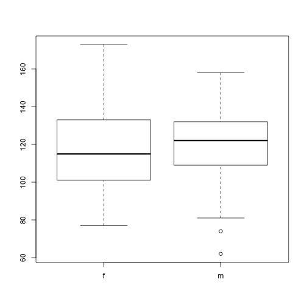

Note that this lesson is based on two chapters from the `r-novice-inflammation` lesson, [http://swcarpentry.github.io/r-novice-inflammation/13-supp-data-structures/](http://swcarpentry.github.io/r-novice-inflammation/13-supp-data-structures/) and 
[http://swcarpentry.github.io/r-novice-inflammation/12-supp-factors/](http://swcarpentry.github.io/r-novice-inflammation/12-supp-factors/). I combined the two together for this chapter.

The other lesson that covers the same topic is `r-novice-gapminder` [http://swcarpentry.github.io/r-novice-gapminder/04-data-structures-part1/](http://swcarpentry.github.io/r-novice-gapminder/04-data-structures-part1/) and [http://swcarpentry.github.io/r-novice-gapminder/05-data-structures-part2/](http://swcarpentry.github.io/r-novice-gapminder/05-data-structures-part2/). Those chapters are a bit more user friendly but I think the inflammation ones are more thorough (especially on factors). I may try to unify the examples from both lessons later on or we may decide to switch to the simpler (?) gapminder lesson approach.

Also note that this lesson discusses both type and mode of vectors, but does not explain if, why and how the two are different.

## Table of contents <a name="Top">&nbsp;</a>

Click a link to jump to a section:

- [Understanding Basic Data Types in R](#basic)
- [Atomic Vectors](#atomic)
- [The Different Vector Modes](#vectormodes)
- [Examining Vectors](#vectors)
- [Adding Elements](#adding)
- [Vectors from a Sequence of Numbers](#sequence)
- [Missing Data](#missing)
- [Other Special Values](#special)
- [What Happens When You Mix Types Inside a Vector?](#mixeddata)
- [Objects Attributes](#attributes)
- [Factors](#factors)
- [Converting Factors](#converting)
- [Using Factors](#using)
- [Removing Levels from a Factor](#levels)
- [Matrix](#matrix)
- [List](#list)

## Understanding Basic Data Types in R

To make the best of the R language, you'll need a strong understanding of the
basic data types and data structures and how to operate on those, as these are the objects you will manipulate on a day-to-day basis in R. Dealing with object conversions is one of the most common sources of frustration for beginners.

**Everything** in R is an object.

R has six atomic vector types (although we will not discuss the raw class for this workshop).

* character
* numeric (real or decimal)
* integer
* logical
* complex

By *atomic* we mean the vector only holds data of a single type.

* **character**: `"a"`, `"swc"`
* **numeric**: `2`, `15.5`
* **integer**: `2L` (the `L` tells R to store this as an integer)
* **logical**: `TRUE`, `FALSE`
* **complex**: `1+4i` (complex numbers with real and imaginary parts)

R provides many functions to examine features of vectors and other objects, for
example

* `class()` - what kind of object is it (high-level)?
* `typeof()` - what is the object's data type (low-level)?
* `length()` - how long is it? What about two dimensional objects?
* `attributes()` - does it have any metadata?

~~~
# Example
x <- "dataset"
typeof(x)
~~~
{: .r}

~~~
[1] "character"
~~~
{: .output}

~~~
attributes(x)
~~~
{: .r}

~~~
NULL
~~~
{: .output}

~~~
y <- 1:10
y
~~~
{: .r}

~~~
 [1]  1  2  3  4  5  6  7  8  9 10
~~~
{: .output}

~~~
typeof(y)
~~~
{: .r}

~~~
[1] "integer"
~~~
{: .output}

~~~
length(y)
~~~
{: .r}

~~~
[1] 10
~~~
{: .output}

~~~
z <- as.numeric(y)
z
~~~
{: .r}

~~~
 [1]  1  2  3  4  5  6  7  8  9 10
~~~
{: .output}

~~~
typeof(z)
~~~
{: .r}

~~~
[1] "double"
~~~
{: .output}

Apart from atomic vector, R has other __data structures__:

* list
* matrix
* data frame
* factors

## <a name="atomic">Atomic Vectors</a> [&#10514;](#Top)

A vector is the most common and basic data structure in R and is pretty much the
workhorse of R. Technically, vectors can be one of two types:

* atomic vectors
* lists

although the term "vector" most commonly refers to the atomic types not to lists.

### <a name="vectormodes">The Different Vector Modes</a> [&#10514;](#Top)

A vector is a collection of elements that are most commonly of mode `character`,
`logical`, `integer` or `numeric`.

You can create an empty vector with `vector()`. (By default the mode is
`logical`. You can be more explicit as shown in the examples below.) It is more
common to use direct constructors such as `character()`, `numeric()`, etc.

~~~
vector() # an empty 'logical' (the default) vector
~~~
{: .r}

~~~
logical(0)
~~~
{: .output}

~~~
vector("character", length = 5) # a vector of mode 'character' with 5 elements
~~~
{: .r}

~~~
[1] "" "" "" "" ""
~~~
{: .output}

~~~
character(5) # the same thing, but using the constructor directly
~~~
{: .r}

~~~
[1] "" "" "" "" ""
~~~
{: .output}

~~~
numeric(5)   # a numeric vector with 5 elements
~~~
{: .r}

~~~
[1] 0 0 0 0 0
~~~
{: .output}

~~~
logical(5)   # a logical vector with 5 elements
~~~
{: .r}

~~~
[1] FALSE FALSE FALSE FALSE FALSE
~~~
{: .output}

You can also create vectors by directly specifying their content. R will then
guess the appropriate mode of storage for the vector. For instance:

~~~
x <- c(1, 2, 3)
~~~
{: .r}

will create a vector `x` of mode `numeric`. These are the most common kind, and
are treated as double precision real numbers. If you wanted to explicitly create
integers, you need to add an `L` to each element (or *coerce* to the integer
type using `as.integer()`).

~~~
x1 <- c(1L, 2L, 3L)
~~~
{: .r}

Using `TRUE` and `FALSE` will create a vector of mode `logical`:

~~~
y <- c(TRUE, TRUE, FALSE, FALSE)
~~~
{: .r}

While using quoted text will create a vector of mode `character`:

~~~
z <- c("Sarah", "Tracy", "Jon")
~~~
{: .r}

### <a name="vectors">Examining Vectors</a> [&#10514;](#Top)

The functions `typeof()`, `length()`, `class()` and `str()` provide useful
information about your vectors and R objects in general.

~~~
typeof(z)
~~~
{: .r}

~~~
[1] "character"
~~~
{: .output}

~~~
length(z)
~~~
{: .r}

~~~
[1] 3
~~~
{: .output}

~~~
class(z)
~~~
{: .r}

~~~
[1] "character"
~~~
{: .output}

~~~
str(z)
~~~
{: .r}

~~~
 chr [1:3] "Sarah" "Tracy" "Jon"
~~~
{: .output}

> ## Finding Commonalities
>
> Do you see a property that's common to all these vectors above?
{: .challenge}

### <a name="adding">Adding Elements</a> [&#10514;](#Top)

The function `c()` (for combine) can also be used to add elements to a vector.

~~~
z <- c(z, "Annette")
z
~~~
{: .r}

~~~
[1] "Sarah"   "Tracy"   "Jon"     "Annette"
~~~
{: .output}

~~~
z <- c("Greg", z)
z
~~~
{: .r}

~~~
[1] "Greg"    "Sarah"   "Tracy"   "Jon"     "Annette"
~~~
{: .output}

### <a name="sequence">Vectors from a Sequence of Numbers</a> [&#10514;](#Top)

You can create vectors as a sequence of numbers.

~~~
series <- 1:10
seq(10)
~~~
{: .r}

~~~
 [1]  1  2  3  4  5  6  7  8  9 10
~~~
{: .output}

~~~
seq(from = 1, to = 10, by = 0.1)
~~~
{: .r}

~~~
 [1]  1.0  1.1  1.2  1.3  1.4  1.5  1.6  1.7  1.8  1.9  2.0  2.1  2.2  2.3
[15]  2.4  2.5  2.6  2.7  2.8  2.9  3.0  3.1  3.2  3.3  3.4  3.5  3.6  3.7
[29]  3.8  3.9  4.0  4.1  4.2  4.3  4.4  4.5  4.6  4.7  4.8  4.9  5.0  5.1
[43]  5.2  5.3  5.4  5.5  5.6  5.7  5.8  5.9  6.0  6.1  6.2  6.3  6.4  6.5
[57]  6.6  6.7  6.8  6.9  7.0  7.1  7.2  7.3  7.4  7.5  7.6  7.7  7.8  7.9
[71]  8.0  8.1  8.2  8.3  8.4  8.5  8.6  8.7  8.8  8.9  9.0  9.1  9.2  9.3
[85]  9.4  9.5  9.6  9.7  9.8  9.9 10.0
~~~
{: .output}

### <a name="#missing">Missing Data</a> [&#10514;](#Top)

R supports missing data in vectors. They are represented as `NA` (Not Available)
and can be used for all the vector types covered in this lesson:

~~~
x <- c(0.5, NA, 0.7)
x <- c(TRUE, FALSE, NA)
x <- c("a", NA, "c", "d", "e")
x <- c(1+5i, 2-3i, NA)
~~~
{: .r}

The function `is.na()` indicates the elements of the vectors that represent
missing data, and the function `anyNA()` returns `TRUE` if the vector contains
any missing values:

~~~
x <- c("a", NA, "c", "d", NA)
y <- c("a", "b", "c", "d", "e")
is.na(x)
~~~
{: .r}

~~~
[1] FALSE  TRUE FALSE FALSE  TRUE
~~~
{: .output}

~~~
is.na(y)
~~~
{: .r}

~~~
[1] FALSE FALSE FALSE FALSE FALSE
~~~
{: .output}

~~~
anyNA(x)
~~~
{: .r}

~~~
[1] TRUE
~~~
{: .output}

~~~
anyNA(y)
~~~
{: .r}

~~~
[1] FALSE
~~~
{: .output}

### <a name="special">Other Special Values</a> [&#10514;](#Top)

`Inf` is infinity. You can have either positive or negative infinity.

~~~
1/0
~~~
{: .r}

~~~
[1] Inf
~~~
{: .output}

`NaN` means Not a Number. It's an undefined value.

~~~
0/0
~~~
{: .r}

~~~
[1] NaN
~~~
{: .output}

### <a name="mixeddata">What Happens When You Mix Types Inside vector?</a> [&#10514;](#Top)

R will create a resulting vector with a mode that can most easily accommodate
all the elements it contains. This conversion between modes of storage is called
"coercion". When R converts the mode of storage based on its content, it is
referred to as "implicit coercion". For instance, can you guess what the
following do (without running them first)?

~~~
xx <- c(1.7, "a")
xx <- c(TRUE, 2)
xx <- c("a", TRUE)
~~~
{: .r}

You can also control how vectors are coerced explicitly using the
`as.<class_name>()` functions:

~~~
as.numeric("1")
~~~
{: .r}

~~~
[1] 1
~~~
{: .output}

~~~
as.character(1:2)
~~~
{: .r}

~~~
[1] "1" "2"
~~~
{: .output}

### <a name="attributes">Objects Attributes</a> [&#10514;](#Top)

Objects can have __attributes__. Attributes are part of the object. These include:

* names
* dimnames
* dim
* class
* attributes (contain metadata)

You can also glean other attribute-like information such as length (works on
vectors and lists) or number of characters (for character strings).

~~~
length(1:10)
~~~
{: .r}

~~~
[1] 10
~~~
{: .output}

~~~
nchar("Software Carpentry")
~~~
{: .r}

~~~
[1] 18
~~~
{: .output}

## <a name="factors">Factors</a> [&#10514;](#Top)

Factors are used to represent categorical data. Factors can be ordered or
unordered and are an important class for statistical analysis and for plotting.

Factors are stored as integers, and have labels associated with these unique
integers. While factors look (and often behave) like character vectors, they are
actually integers under the hood, and you need to be careful when treating them
like strings.

Once created, factors can only contain a pre-defined set values, known as
*levels*. By default, R always sorts *levels* in alphabetical order. For
instance, if you have a factor with 2 levels:

> ## The `factor()` Command
>
> The `factor()` command is used to create and modify factors in R:
>
> 
> ~~~
> sex <- factor(c("male", "female", "female", "male"))
> ~~~
> {: .r}
{: .callout}

R will assign `1` to the level `"female"` and `2` to the level `"male"` (because
`f` comes before `m`, even though the first element in this vector is
`"male"`). You can check this by using the function `levels()`, and check the
number of levels using `nlevels()`:

~~~
levels(sex)
~~~
{: .r}

~~~
[1] "female" "male"  
~~~
{: .output}

~~~
nlevels(sex)
~~~
{: .r}

~~~
[1] 2
~~~
{: .output}

Sometimes, the order of the factors does not matter, other times you might want
to specify the order because it is meaningful (e.g., "low", "medium", "high") or
it is required by particular type of analysis. Additionally, specifying the
order of the levels allows us to compare levels:

~~~
food <- factor(c("low", "high", "medium", "high", "low", "medium", "high"))
levels(food)
~~~
{: .r}

~~~
[1] "high"   "low"    "medium"
~~~
{: .output}

~~~
food <- factor(food, levels = c("low", "medium", "high"))
levels(food)
~~~
{: .r}

~~~
[1] "low"    "medium" "high"  
~~~
{: .output}

~~~
min(food) ## doesn't work
~~~
{: .r}

~~~
Error in Summary.factor(structure(c(1L, 3L, 2L, 3L, 1L, 2L, 3L), .Label = c("low", : 'min' not meaningful for factors
~~~
{: .error}

~~~
food <- factor(food, levels = c("low", "medium", "high"), ordered=TRUE)
levels(food)
~~~
{: .r}

~~~
[1] "low"    "medium" "high"  
~~~
{: .output}

~~~
min(food) ## works!
~~~
{: .r}

~~~
[1] low
Levels: low < medium < high
~~~
{: .output}

In R's memory, these factors are represented by numbers (1, 2, 3). They are
better than using simple integer labels because factors are self describing:
`"low"`, `"medium"`, and `"high"`" is more descriptive than `1`, `2`, `3`. Which
is low?  You wouldn't be able to tell with just integer data. Factors have this
information built in. It is particularly helpful when there are many levels
(like the subjects in our example data set).

> ## Representing Data in R
>
> You have a vector representing levels of exercise undertaken by 5 subjects
>
> **"l","n","n","i","l"** ; n=none, l=light, i=intense
>
> What is the best way to represent this in R?
>
> a) exercise <- c("l", "n", "n", "i", "l")
>
> b) exercise <- factor(c("l", "n", "n", "i", "l"), ordered = TRUE)
>
> c) exercise < -factor(c("l", "n", "n", "i", "l"), levels = c("n", "l", "i"), ordered = FALSE)
>
> d) exercise <- factor(c("l", "n", "n", "i", "l"), levels = c("n", "l", "i"), ordered = TRUE)
{: .challenge}

### <a name="converting">Converting Factors</a> [&#10514;](#Top)

Converting from a factor to a number can cause problems:

~~~
f <- factor(c(3.4, 1.2, 5))
as.numeric(f)
~~~
{: .r}

~~~
[1] 2 1 3
~~~
{: .output}

This does not behave as expected (and there is no warning).

The recommended way is to use the integer vector to index the factor levels:

~~~
levels(f)[f]
~~~
{: .r}

~~~
[1] "3.4" "1.2" "5"  
~~~
{: .output}

This returns a character vector, the `as.numeric()` function is still required to convert the values to the proper type (numeric).

~~~
f <- levels(f)[f]
f <- as.numeric(f)
~~~
{: .r}

### <a name="using">Using Factors</a> [&#10514;](#Top)

Lets load our example data to see the use of factors:

~~~
dat <- read.csv(file = 'data/sample.csv', stringsAsFactors = TRUE)
~~~
{: .r}

> ## Default Behavior
>
> `stringsAsFactors=TRUE` is the default behavior for R.
> We could leave this argument out.
> It is included here for clarity.
{: .callout}

~~~
str(dat)
~~~
{: .r}

~~~
'data.frame':	100 obs. of  9 variables:
 $ ID           : Factor w/ 100 levels "Sub001","Sub002",..: 1 2 3 4 5 6 7 8 9 10 ...
 $ Gender       : Factor w/ 4 levels "f","F","m","M": 3 3 3 1 3 4 1 3 3 1 ...
 $ Group        : Factor w/ 3 levels "Control","Treatment1",..: 1 3 3 2 2 3 1 3 3 1 ...
 $ BloodPressure: int  132 139 130 105 125 112 173 108 131 129 ...
 $ Age          : num  16 17.2 19.5 15.7 19.9 14.3 17.7 19.8 19.4 18.8 ...
 $ Aneurisms_q1 : int  114 148 196 199 188 260 135 216 117 188 ...
 $ Aneurisms_q2 : int  140 209 251 140 120 266 98 238 215 144 ...
 $ Aneurisms_q3 : int  202 248 122 233 222 320 154 279 181 192 ...
 $ Aneurisms_q4 : int  237 248 177 220 228 294 245 251 272 185 ...
~~~
{: .output}

Notice the first 3 columns have been converted to factors. These values were text in the data file so R automatically interpreted them as categorical variables.

~~~
summary(dat)
~~~
{: .r}

~~~
       ID     Gender        Group    BloodPressure        Age       
 Sub001 : 1   f:35   Control   :30   Min.   : 62.0   Min.   :12.10  
 Sub002 : 1   F: 4   Treatment1:35   1st Qu.:107.5   1st Qu.:14.78  
 Sub003 : 1   m:46   Treatment2:35   Median :117.5   Median :16.65  
 Sub004 : 1   M:15                   Mean   :118.6   Mean   :16.42  
 Sub005 : 1                          3rd Qu.:133.0   3rd Qu.:18.30  
 Sub006 : 1                          Max.   :173.0   Max.   :20.00  
 (Other):94                                                         
  Aneurisms_q1    Aneurisms_q2    Aneurisms_q3    Aneurisms_q4  
 Min.   : 65.0   Min.   : 80.0   Min.   :105.0   Min.   :116.0  
 1st Qu.:118.0   1st Qu.:131.5   1st Qu.:182.5   1st Qu.:186.8  
 Median :158.0   Median :162.5   Median :217.0   Median :219.0  
 Mean   :158.8   Mean   :168.0   Mean   :219.8   Mean   :217.9  
 3rd Qu.:188.0   3rd Qu.:196.8   3rd Qu.:248.2   3rd Qu.:244.2  
 Max.   :260.0   Max.   :283.0   Max.   :323.0   Max.   :315.0  
                                                                
~~~
{: .output}

Notice the `summary()` function handles factors differently to numbers (and strings), the occurrence counts for each value is often more useful information.

> ## The `summary()` Function
>
> The `summary()` function is a great way of spotting errors in your data (look at the *dat$Gender* column).
> It's also a great way for spotting missing data.
{: .callout}

> ## Reordering Factors
>
> The function `table()` tabulates observations and can be used to create bar plots quickly. For instance:
>
> 
> ~~~
> table(dat$Group)
> ~~~
> {: .r}
> 
> 
> 
> ~~~
> 
>    Control Treatment1 Treatment2 
>         30         35         35 
> ~~~
> {: .output}
> 
> 
> 
> ~~~
> barplot(table(dat$Group))
> ~~~
> {: .r}
> 
> 
> Use the `factor()` command to modify the column dat$Group so that the *control* group is plotted last
{: .challenge}

### <a name="levels">Removing Levels from a Factor</a> [&#10514;](#Top)

Some of the Gender values in our dataset have been coded incorrectly.
Let's remove factors.

~~~
barplot(table(dat$Gender))
~~~
{: .r}

Values should have been recorded as lowercase 'm' & 'f'. We should correct this.

~~~
dat$Gender[dat$Gender == 'M'] <- 'm'
~~~
{: .r}

> ## Updating Factors
>
> 
> ~~~
> plot(x = dat$Gender, y = dat$BloodPressure)
> ~~~
> {: .r}
> 
> 
>
> Why does this plot show 4 levels?
>
> *Hint* how many levels does dat$Gender have?
{: .challenge}

We need to tell R that "M" is no longer a valid value for this column.
We use the `droplevels()` function to remove extra levels.

~~~
dat$Gender <- droplevels(dat$Gender)
plot(x = dat$Gender, y = dat$BloodPressure)
~~~
{: .r}

> ## Adjusting Factor Levels
>
> Adjusting the `levels()` of a factor provides a useful shortcut for reassigning values in this case.
>
> 
> ~~~
> levels(dat$Gender)[2] <- 'f'
> plot(x = dat$Gender, y = dat$BloodPressure)
> ~~~
> {: .r}
> 
> 
{: .callout}

## <a name="matrix">Matrix</a> [&#10514;](#Top)

In R matrices are an extension of the numeric or character vectors. They are not
a separate type of object but simply an atomic vector with dimensions; the
number of rows and columns.

~~~
m <- matrix(nrow = 2, ncol = 2)
m
~~~
{: .r}

~~~
     [,1] [,2]
[1,]   NA   NA
[2,]   NA   NA
~~~
{: .output}

~~~
dim(m)
~~~
{: .r}

~~~
[1] 2 2
~~~
{: .output}

Matrices in R are filled column-wise.

~~~
m <- matrix(1:6, nrow = 2, ncol = 3)
~~~
{: .r}

Other ways to construct a matrix

~~~
m      <- 1:10
dim(m) <- c(2, 5)
~~~
{: .r}

This takes a vector and transforms it into a matrix with 2 rows and 5 columns.

Another way is to bind columns or rows using `cbind()` and `rbind()`.

~~~
x <- 1:3
y <- 10:12
cbind(x, y)
~~~
{: .r}

~~~
     x  y
[1,] 1 10
[2,] 2 11
[3,] 3 12
~~~
{: .output}

~~~
rbind(x, y)
~~~
{: .r}

~~~
  [,1] [,2] [,3]
x    1    2    3
y   10   11   12
~~~
{: .output}

You can also use the `byrow` argument to specify how the matrix is filled. From R's own documentation:

~~~
mdat <- matrix(c(1,2,3, 11,12,13), nrow = 2, ncol = 3, byrow = TRUE)
mdat
~~~
{: .r}

~~~
     [,1] [,2] [,3]
[1,]    1    2    3
[2,]   11   12   13
~~~
{: .output}

Elements of a matrix can be referenced by specifying the index along each dimension (e.g. "row" and "column") in single square brackets.

~~~
mdat[2,3]
~~~
{: .r}

~~~
[1] 13
~~~
{: .output}

## <a name="list">List</a> [&#10514;](#Top)

In R lists act as containers. Unlike atomic vectors, the contents of a list are
not restricted to a single mode and can encompass any mixture of data
types. Lists are sometimes called generic vectors, because the elements of a
list can by of any type of R object, even lists containing further lists. This
property makes them fundamentally different from atomic vectors.

A list is a special type of vector. Each element can be a different type.

Create lists using `list()` or coerce other objects using `as.list()`. An empty
list of the required length can be created using `vector()`

~~~
x <- list(1, "a", TRUE, 1+4i)
x
~~~
{: .r}

~~~
[[1]]
[1] 1

[[2]]
[1] "a"

[[3]]
[1] TRUE

[[4]]
[1] 1+4i
~~~
{: .output}

~~~
x <- vector("list", length = 5) ## empty list
length(x)
~~~
{: .r}

~~~
[1] 5
~~~
{: .output}

The content of elements of a list can be retrieved by using double square brackets.

~~~
x[[1]]
~~~
{: .r}

~~~
NULL
~~~
{: .output}

Vectors can be coerced to lists as follows:

~~~
x <- 1:10
x <- as.list(x)
length(x)
~~~
{: .r}

~~~
[1] 10
~~~
{: .output}

1. What is the class of `x[1]`?
2. What about `x[[1]]`?

Elements of a list can be named (i.e. lists can have the `names` atttibute)

~~~
xlist <- list(a = "Karthik Ram", b = 1:10, data = head(iris))
xlist
~~~
{: .r}

~~~
$a
[1] "Karthik Ram"

$b
 [1]  1  2  3  4  5  6  7  8  9 10

$data
  Sepal.Length Sepal.Width Petal.Length Petal.Width Species
1          5.1         3.5          1.4         0.2  setosa
2          4.9         3.0          1.4         0.2  setosa
3          4.7         3.2          1.3         0.2  setosa
4          4.6         3.1          1.5         0.2  setosa
5          5.0         3.6          1.4         0.2  setosa
6          5.4         3.9          1.7         0.4  setosa
~~~
{: .output}

~~~
names(xlist)
~~~
{: .r}

~~~
[1] "a"    "b"    "data"
~~~
{: .output}

1. What is the length of this object? What about its structure?

Lists can be extremely useful inside functions. Because the functions in R are able to return only a single object, you can "staple" together lots
of different kinds of results into a single object that a function can return.

A list does not print to the console like a vector. Instead, each element of the
list starts on a new line.

Elements are indexed by double brackets. Single brackets will still return
a(nother) list. If the elements of a list are named, they can be referenced by the `$` notation (i.e. `xlist$data`).
